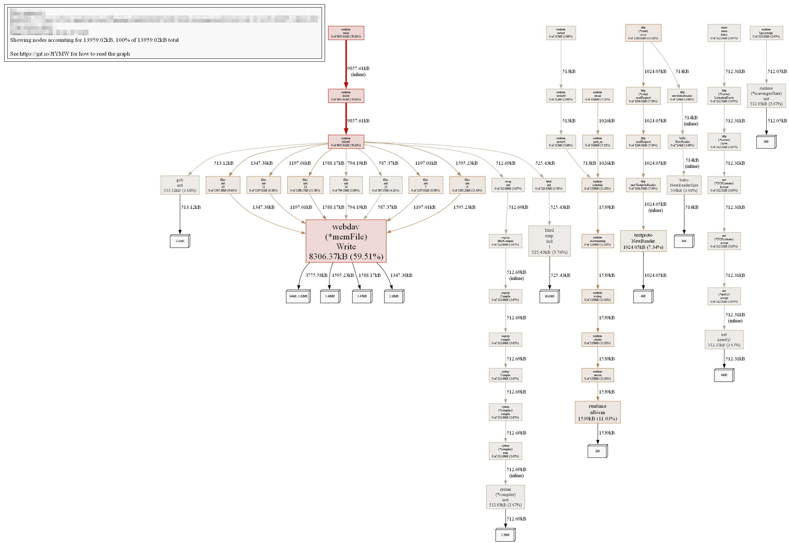

# EchoBoard - 蓝域
产品需求模拟：
一个面向开发者的轻量级技术分享平台，采用小红书式内容流与互动设计，
实现高性能读写与全文搜索、相关推荐能力。
本项目旨在降低学习技术的知识获取门槛，让学技术变得“上瘾”。

## 技术栈

Go 1.24 + Gin + SQLX + MySQL + Redis + Kafka + Elasticsearch +
JWT + Zap + Viper + Snowflake + validator + swagger +
Docker & Compose + pprof

<video src="static/markdown_photo/EchoBoard_show0807.mp4" controls></video>

## 功能亮点

### 业务
- 用户注册/登录，基于 JWT 管理 loginToken
- 帖子点赞、收藏、评论feed流系统，使用 wilson 置信区间算法推荐帖子热度排序
- 媒体帖子：纯文字 / 多图图文 / 视频，前端 canvas 截取视频首帧作封面，媒体转存 OSS 后 JSON 结构化落库（`[{type,url,poster}]`）
- 配置 Air 热加载 & Zap分级日志管理
- 分布式 ID 生成 (by Snowflake雪花算法)
- Redis pipeline 批量读写提升性能，启用事务保证执行正确性
- Elasticsearch 支持关键词技术内容高效检索，提升用户体验
- 优雅关停，捕获系统信号确保平滑下线
- 令牌桶限流中间件控制恶意频繁请求
- Kafka 异步消息队列 + 死信队列(DLQ)机制,保证 MySQL 和 Redis 双写的最终一致性和幂等性
- 消费者端实现重试机制(最多3次,指数退避)和死信队列兜底,确保消息不丢失可溯源
```
用户点赞/收藏行为的生产和消费链条 - 以点赞为例
  ↓
【主服务 - main.go】
  ├─ 1. Redis.LikePost() ← 立即返回 ✅
  └─ 2. Kafka.Publish() ← 异步发消息 ✅
  ↓
【Kafka - topic: post_interaction】
  消息队列中存储 {"action":"like", "user_id":123, "post_id":456}
  ↓
【消费者 - cmd/consumer/main.go】
  ├─ 3. 从 Kafka 读消息
  ├─ 4. 解析消息 
  ├─ 5. MySQL.LikePost() ← MySQL 持久化 
  └─ 6. 失败? → 重试3次(指数退避) → 仍失败? → 死信队列(DLQ) ✅
  
总结:
主服务: Redis + Kafka(异步,响应快 <10ms)
消费者: Kafka → MySQL(带重试和DLQ,保证最终一致性)
用户体验: 点赞立即生效(Redis), MySQL 异步落库不阻塞
```

### 部署
- Redis RDB 持久化，容器重启数据不丢失
- Docker Compose 容器化，一键启动 & 端口映射


## 快速开始
### 1. 容器部署
参见根目录下 Dockerfile 和 docker-compose.yml 。

### 2. 本地开发

```bash
go run main.go
```

### 3. tips

#### tip1: 配置
启动前确保根目录下`/conf/config.yaml` `/conf/config_dev.yaml` 配置齐。

配置举例：
```yaml
app:
  name: "web_app"
  mode: "dev"
  host: "127.0.0.1"
  port: 8081
  version: "v0.1.0"
  start_time: "2025-07-26"
  machine_id: 1
auth:
  jwt_expire: 2
log:
  level: "debug"
  filename: "web_app.log"
  max_size: 200
  max_age: 30
  max_backups: 7
mysql:
  host: "127.0.0.1"
  port: 3306
  user: ""
  password: ""
  dbname: ""
  max_open_conns: 200
  max_idle_conns: 50
redis:
  host: "127.0.0.1"
  port: 6379
  password: ""
  db: 0
  pool_size: 100
es:
  host: "127.0.0.1"
  port: 9200
kafka:
  # producer 生产者端配置
  brokers:
    - ""
  compression: "snappy"
  max_attempts: 3 
  batch_size: 100 
  batch_timeout: 10  
  required_acks: 1 
  # consumer 消费者端配置
  consumer_group: "post-interaction-consumer-group"
  min_bytes: 10240      # 10KB
  max_bytes: 10485760   # 10MB
  # DLQ(死信队列)配置
  dlq_topic: "post-interaction-dlq"  # 死信队列 topic
  max_retries: 3                     # 消费者最大重试次数
```
#### tip2: 本地开发已配置热加载启动

```bash
air
```

#### tip3: 访问接口文档

```bash
swag init
```
访问：
http://你的IP:端口号/swagger/index.html

## 压测结果

使用外部压测工具 `hey`（ https://github.com/rakyll/hey ）

示例:（不启动限流中间件，本地单机测试在 100 并发下可承受 1万 QPS，p99 < 25ms）
```
hey -n 10000 -c 100 -cpus 8 "http://xxxx/api/v1/posts2" 
```
测试结果：
```
Summary:
  Total:        0.9268 secs
  Slowest:      0.0425 secs
  Fastest:      0.0002 secs
  Average:      0.0090 secs
  Requests/sec: 10789.7970
  
  Total data:   380000 bytes
  Size/request: 38 bytes

Response time histogram:
  0.000 [1]     |
  0.004 [184]   |■■
  0.009 [4825]  |■■■■■■■■■■■■■■■■■■■■■■■■■■■■■■■■■■■■■■■■
  0.013 [4698]  |■■■■■■■■■■■■■■■■■■■■■■■■■■■■■■■■■■■■■■■
  0.017 [47]    |
  0.021 [71]    |■
  0.026 [78]    |■
  0.030 [17]    |
  0.034 [28]    |
  0.038 [44]    |
  0.043 [7]     |

Latency distribution:
  10% in 0.0077 secs
  25% in 0.0082 secs
  50% in 0.0087 secs
  75% in 0.0092 secs
  90% in 0.0099 secs
  95% in 0.0108 secs
  99% in 0.0245 secs

Status code distribution:
  [200] 10000 responses
```

测试结果2（启动令牌桶限流）：

```
Summary:
  Total:        1.0762 secs
  Slowest:      0.0485 secs
  Fastest:      0.0002 secs
  Average:      0.0106 secs
  Requests/sec: 9292.3624
  
  Total data:   419960 bytes
  Size/request: 41 bytes
  
Response time histogram:
  0.000 [1]     |
  0.005 [194]   |■■
  0.010 [4524]  |■■■■■■■■■■■■■■■■■■■■■■■■■■■■■■■■■■■■■■■
  0.015 [4618]  |■■■■■■■■■■■■■■■■■■■■■■■■■■■■■■■■■■■■■■■■
  0.019 [300]   |■■■
  0.024 [71]    |■
  0.029 [177]   |■■
  0.034 [96]    |■
  0.039 [17]    |
  0.044 [1]     |
  0.048 [1]     |

Latency distribution:
  10% in 0.0084 secs
  25% in 0.0090 secs
  50% in 0.0099 secs
  75% in 0.0107 secs
  90% in 0.0125 secs
  95% in 0.0169 secs
  99% in 0.0301 secs

Status code distribution:
  [200] 10 responses
  [429] 9990 responses
```

## pprof 性能分析

示例（内存篇 配合压测）:

```
go tool pprof -inuse_space http://xxxx/debug/pprof/heap
```



注：可视化工具 [graphviz](https://graphviz.gitlab.io/)
