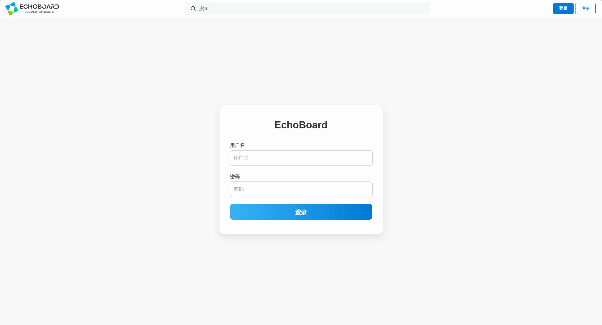
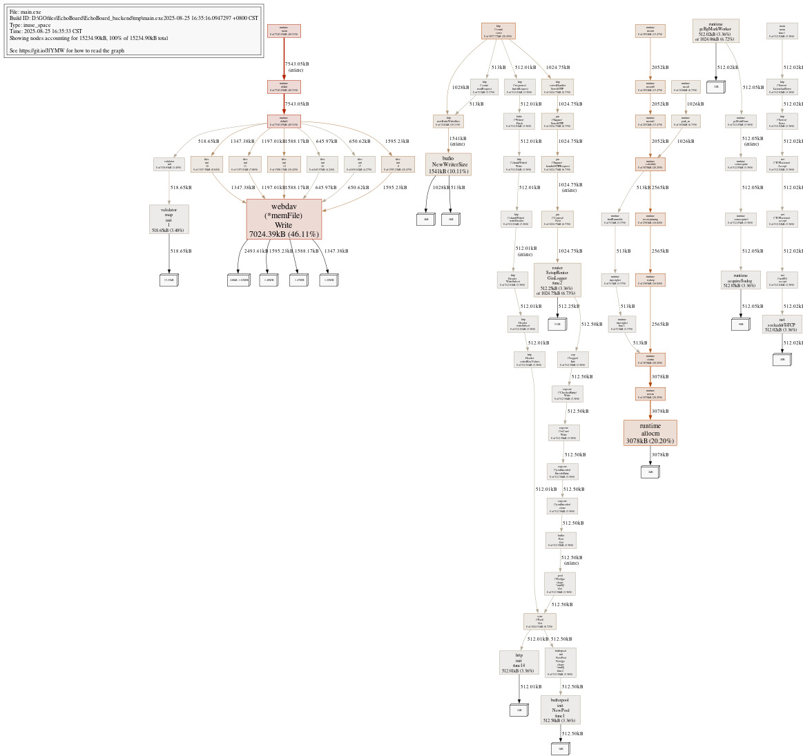

# EchoBoard

## 技术栈

Go 1.24 + Gin + SQLX + MySQL + Redis + JWT + Zap + Viper + Snowflake + validator + swagger + fsnotify + Docker&Compose + pprof

## 功能亮点

### 业务
- 用户注册/登录，基于 JWT 管理 Token
- 帖子投票系统，Redis 缓存加速
- 配置热加载 & 日志管理
- 分布式 ID 生成 (Snowflake)
- Redis pipeline 批量读写提升性能
- 优雅关停，捕获系统信号确保平滑下线
- 令牌桶限流中间件控制高并发

### 部署
- Redis RDB 持久化，容器重启数据不丢失
- Docker Compose 容器化，一键启动 & 端口映射

<br>




## 项目启动命令


```bash
go run main.go
```

tips: 启动前确保根目录下`/conf/config.yaml` `/conf/config_dev.yaml` 配置齐。

## 已配置热加载启动

```bash
air
```

## 访问接口文档

```bash
swag init
```
访问：
http://127.0.0.1:8081/swagger/index.html

## 压测结果

使用外部压测工具 `hey`（ https://github.com/rakyll/hey ）

示例:（不启动限流中间件）
```
hey -n 10000 -c 100 -cpus 8 "http://127.0.0.1:8081/api/v1/posts" 
```
测试结果：
```
Summary:
  Total:        0.7265 secs
  Slowest:      0.0316 secs
  Fastest:      0.0001 secs
  Average:      0.0072 secs
  Requests/sec: 13764.9356
 
Status code distribution:
  [200] 10000 responses
```

测试结果2（启动令牌桶限流）：

```
Summary:
  Total:        0.8275 secs
  Slowest:      0.0593 secs
  Fastest:      0.0001 secs
  Average:      0.0082 secs
  Requests/sec: 12084.5162

Status code distribution:
  [200] 10 responses
  [429] 9990 responses
```

## pprof 性能分析

示例（内存篇 配合压测）:

```
go tool pprof -inuse_space http://127.0.0.1:8081/debug/pprof/heap
```



注：可视化工具 [graphviz](https://graphviz.gitlab.io/)
